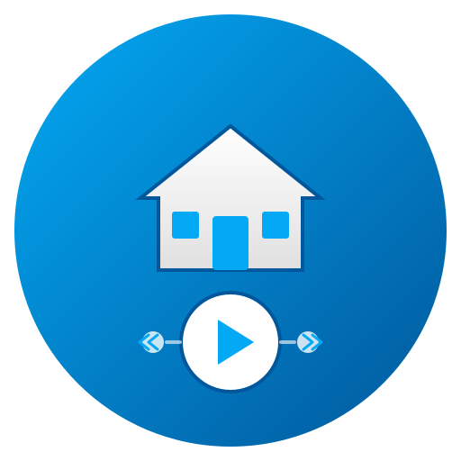
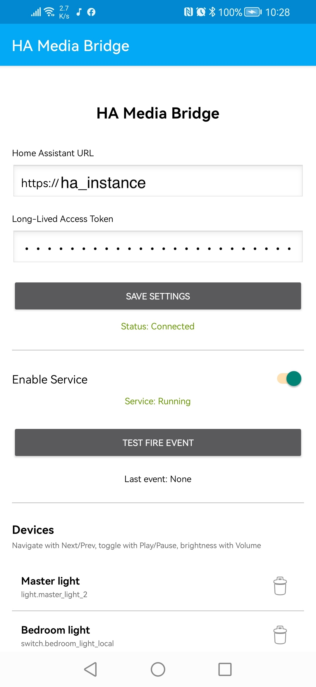
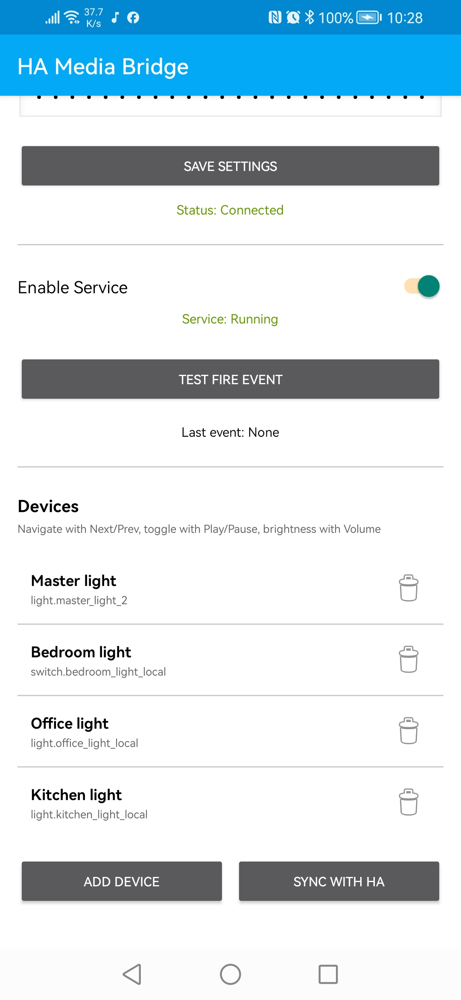
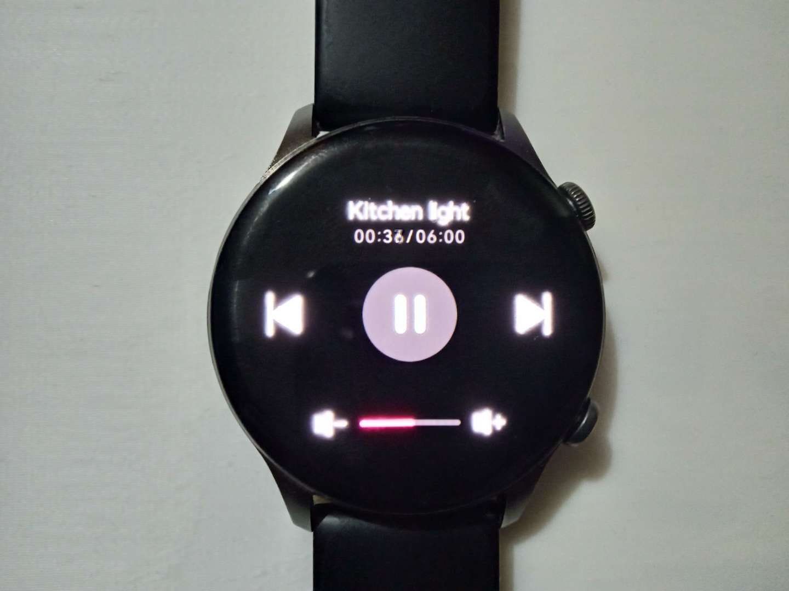

<p align="center">
  
</p>

<h1 align="center">HA Media Bridge</h1>

<p align="center">
  An Android application that bridges media control buttons (from smartwatches, Bluetooth headphones, car stereos, etc.) to Home Assistant events. Control your smart home devices using familiar media controls - play/pause to toggle devices, next/previous to switch between devices, and volume buttons to adjust brightness.
</p>

---

## Disclaimer

> **This entire project was designed and built by Claude (Anthropic's AI assistant).**
>
> This software is provided "AS IS", without warranty of any kind, express or implied, including but not limited to the warranties of merchantability, fitness for a particular purpose, and noninfringement. In no event shall the authors, contributors, or Claude AI be liable for any claim, damages, or other liability, whether in an action of contract, tort, or otherwise, arising from, out of, or in connection with the software or the use or other dealings in the software.
>
> **Use at your own risk.** This is an experimental project created through AI-assisted development. While efforts have been made to ensure functionality and security, no guarantees are provided. Always review the code before using it in any production or sensitive environment.

---

## Screenshots

### Android Application

| Main Screen | Device List |
|:-----------:|:-----------:|
|  |  |

### Smartwatch Control

| Device Control | Volume/Brightness |
|:--------------:|:-----------------:|
|  |  |

---

## Features

- **Device Playlist**: Configure a list of Home Assistant entities to control
- **Media Button Control**: Use play/pause, next/prev, and volume buttons from any Bluetooth device
- **Real-time State Sync**: Fetches actual device state from Home Assistant when switching devices
- **Two-way Sync**: Manage device list from the app or from Home Assistant
- **Background Service**: Runs reliably in the background with battery optimization exemption
- **Smartwatch Support**: Works with any smartwatch that supports media controls

## How It Works

```
┌─────────────────┐     ┌──────────────────────┐     ┌─────────────────┐
│ Media Buttons   │────▶│ HA Media Bridge App  │────▶│ Home Assistant  │
│ (smartwatch,    │     │ - Device playlist    │     │ Events:         │
│  headphones,    │     │ - Current device     │     │ - device_on     │
│  car stereo)    │     │ - Volume tracking    │     │ - device_off    │
└─────────────────┘     └──────────────────────┘     │ - device_volume │
                                                      └─────────────────┘
```

| Button | Action |
|--------|--------|
| **Play** | Send `android_device_on` event (turn on device) |
| **Pause** | Send `android_device_off` event (turn off device) |
| **Next** | Switch to next device in playlist |
| **Previous** | Switch to previous device in playlist |
| **Volume Up/Down** | Send `android_device_volume` event (adjust brightness) |

## Requirements

- Android 8.0 (API 26) or higher
- Home Assistant 2023.1.0 or higher
- Long-lived access token from Home Assistant

## Installation

### Home Assistant Integration (HACS - Recommended)

The easiest way to set up the Home Assistant side is using HACS:

[](https://my.home-assistant.io/redirect/hacs_repository/?owner=mwenghi&repository=ha-media-bridge&category=integration)

**Manual HACS Installation:**

1. Open HACS in Home Assistant
2. Click the three dots menu → **Custom repositories**
3. Add repository URL: `https://github.com/mwenghi/ha-media-bridge`
4. Category: **Integration**
5. Click **Add**
6. Search for "HA Media Bridge" and install
7. Restart Home Assistant
8. Go to **Settings → Devices & Services → Add Integration**
9. Search for "HA Media Bridge" and configure

**What the integration provides:**
- Automatic event listeners for `android_device_on`, `android_device_off`, `android_device_volume`
- Smart device handling (lights, switches, fans, covers, media players, scenes)
- Sensors: Device count and device list with states
- Services: `ha_media_bridge.add_device`, `ha_media_bridge.remove_device`, etc.

**Note:** You still need to create the `input_text` helper manually:

```yaml
# Add to configuration.yaml
input_text:
  android_media_bridge_devices:
    name: "Android Media Bridge Devices"
    max: 255
    mode: text
```

---

### Manual Home Assistant Configuration (Alternative)

If you prefer not to use HACS, see the [Manual Configuration](#manual-home-assistant-configuration) section below.

---

### Android App

1. Download the APK or build from source:
   ```bash
   ./gradlew assembleDebug
   ```

2. Install on your device:
   ```bash
   adb install -r app/build/outputs/apk/debug/app-debug.apk
   ```

3. Open the app and grant required permissions:
   - **Notification permission**: Required for foreground service
   - **Battery optimization exemption**: Required for reliable background operation

### Manual Home Assistant Configuration

> **Note:** If you installed the HACS integration, skip this section. You only need to create the `input_text` helper (shown above).

Add the following to your Home Assistant configuration:

#### 1. Input Text Helper (for device list sync)

Add to `configuration.yaml`:

```yaml
input_text:
  android_media_bridge_devices:
    name: "Android Media Bridge Devices"
    max: 255
    mode: text
```

#### 2. Template Sensors (for displaying device list)

Add to `configuration.yaml`:

```yaml
template:
  - sensor:
      - name: "Android Media Bridge Device Count"
        unique_id: android_media_bridge_device_count
        icon: mdi:devices
        state: >
          
          
            {{ (current | from_json) | length }}
          
            0
          

      - name: "Android Media Bridge Device List"
        unique_id: android_media_bridge_device_list
        icon: mdi:format-list-bulleted
        state: >
          
          
            
            {{ devices | length }} devices
          
            No devices
          
        attributes:
          devices: >
            
            
              
              
              
                
              
              {{ result }}
            
              []
            
```

#### 3. Automations

Add to `automations.yaml`:

```yaml
# Handle Device ON events
- id: android_media_bridge_device_on
  alias: "Android Media Bridge - Device On"
  trigger:
    - platform: event
      event_type: android_device_on
  action:
    - service: script.android_bridge_turn_on
      data:
        entity_id: "{{ trigger.event.data.entity_id }}"
  mode: queued

# Handle Device OFF events
- id: android_media_bridge_device_off
  alias: "Android Media Bridge - Device Off"
  trigger:
    - platform: event
      event_type: android_device_off
  action:
    - service: script.android_bridge_turn_off
      data:
        entity_id: "{{ trigger.event.data.entity_id }}"
  mode: queued

# Handle Volume/Brightness events
- id: android_media_bridge_device_volume
  alias: "Android Media Bridge - Device Volume/Brightness"
  trigger:
    - platform: event
      event_type: android_device_volume
  action:
    - service: script.android_bridge_set_brightness
      data:
        entity_id: "{{ trigger.event.data.entity_id }}"
        brightness_pct: "{{ trigger.event.data.volume }}"
  mode: queued
```

#### 4. Scripts

Add to `scripts.yaml`:

```yaml
# Turn on a device
android_bridge_turn_on:
  alias: "Android Bridge - Turn On Device"
  fields:
    entity_id:
      description: "The entity ID to turn on"
      required: true
  sequence:
    - choose:
        - conditions:
            - condition: template
              value_template: "{{ entity_id.startswith('light.') }}"
          sequence:
            - service: light.turn_on
              target:
                entity_id: "{{ entity_id }}"
        - conditions:
            - condition: template
              value_template: "{{ entity_id.startswith('switch.') }}"
          sequence:
            - service: switch.turn_on
              target:
                entity_id: "{{ entity_id }}"
        - conditions:
            - condition: template
              value_template: "{{ entity_id.startswith('fan.') }}"
          sequence:
            - service: fan.turn_on
              target:
                entity_id: "{{ entity_id }}"
        - conditions:
            - condition: template
              value_template: "{{ entity_id.startswith('media_player.') }}"
          sequence:
            - service: media_player.turn_on
              target:
                entity_id: "{{ entity_id }}"
        - conditions:
            - condition: template
              value_template: "{{ entity_id.startswith('cover.') }}"
          sequence:
            - service: cover.open_cover
              target:
                entity_id: "{{ entity_id }}"
        - conditions:
            - condition: template
              value_template: "{{ entity_id.startswith('scene.') }}"
          sequence:
            - service: scene.turn_on
              target:
                entity_id: "{{ entity_id }}"
      default:
        - service: homeassistant.turn_on
          target:
            entity_id: "{{ entity_id }}"
  mode: queued

# Turn off a device
android_bridge_turn_off:
  alias: "Android Bridge - Turn Off Device"
  fields:
    entity_id:
      description: "The entity ID to turn off"
      required: true
  sequence:
    - choose:
        - conditions:
            - condition: template
              value_template: "{{ entity_id.startswith('light.') }}"
          sequence:
            - service: light.turn_off
              target:
                entity_id: "{{ entity_id }}"
        - conditions:
            - condition: template
              value_template: "{{ entity_id.startswith('switch.') }}"
          sequence:
            - service: switch.turn_off
              target:
                entity_id: "{{ entity_id }}"
        - conditions:
            - condition: template
              value_template: "{{ entity_id.startswith('fan.') }}"
          sequence:
            - service: fan.turn_off
              target:
                entity_id: "{{ entity_id }}"
        - conditions:
            - condition: template
              value_template: "{{ entity_id.startswith('media_player.') }}"
          sequence:
            - service: media_player.turn_off
              target:
                entity_id: "{{ entity_id }}"
        - conditions:
            - condition: template
              value_template: "{{ entity_id.startswith('cover.') }}"
          sequence:
            - service: cover.close_cover
              target:
                entity_id: "{{ entity_id }}"
      default:
        - service: homeassistant.turn_off
          target:
            entity_id: "{{ entity_id }}"
  mode: queued

# Set brightness/volume
android_bridge_set_brightness:
  alias: "Android Bridge - Set Brightness"
  fields:
    entity_id:
      description: "The entity ID to control"
      required: true
    brightness_pct:
      description: "Brightness percentage (0-100)"
      required: true
  sequence:
    - choose:
        - conditions:
            - condition: template
              value_template: "{{ entity_id.startswith('light.') }}"
          sequence:
            - service: light.turn_on
              target:
                entity_id: "{{ entity_id }}"
              data:
                brightness_pct: "{{ brightness_pct | int }}"
        - conditions:
            - condition: template
              value_template: "{{ entity_id.startswith('fan.') }}"
          sequence:
            - service: fan.set_percentage
              target:
                entity_id: "{{ entity_id }}"
              data:
                percentage: "{{ brightness_pct | int }}"
        - conditions:
            - condition: template
              value_template: "{{ entity_id.startswith('media_player.') }}"
          sequence:
            - service: media_player.volume_set
              target:
                entity_id: "{{ entity_id }}"
              data:
                volume_level: "{{ (brightness_pct | int) / 100 }}"
        - conditions:
            - condition: template
              value_template: "{{ entity_id.startswith('cover.') }}"
          sequence:
            - service: cover.set_cover_position
              target:
                entity_id: "{{ entity_id }}"
              data:
                position: "{{ brightness_pct | int }}"
      default:
        - service: light.turn_on
          target:
            entity_id: "{{ entity_id }}"
          data:
            brightness_pct: "{{ brightness_pct | int }}"
  mode: queued

# Add a device to the list (call from HA)
android_bridge_add_device:
  alias: "Android Bridge - Add Device"
  fields:
    name:
      description: "Display name for the device"
      required: true
    entity_id:
      description: "Entity ID to control"
      required: true
  sequence:
    - service: input_text.set_value
      target:
        entity_id: input_text.android_media_bridge_devices
      data:
        value: >
          
          
          
          {{ (devices + [new_device]) | to_json }}
  mode: single

# Remove a device from the list
android_bridge_remove_device:
  alias: "Android Bridge - Remove Device"
  fields:
    entity_id:
      description: "Entity ID to remove"
      required: true
  sequence:
    - service: input_text.set_value
      target:
        entity_id: input_text.android_media_bridge_devices
      data:
        value: >
          
          
          {{ devices | rejectattr('e', 'eq', entity_id) | list | to_json }}
  mode: single

# Clear all devices
android_bridge_clear_devices:
  alias: "Android Bridge - Clear All Devices"
  sequence:
    - service: input_text.set_value
      target:
        entity_id: input_text.android_media_bridge_devices
      data:
        value: "[]"
  mode: single
```

#### 5. Dashboard Card (optional)

Add a Markdown card to your Lovelace dashboard:

```yaml
type: markdown
title: Android Media Bridge Devices
content: |
  
  
    
    | # | Name | Entity | State |
    |---|------|--------|-------|
    
    | {{ loop.index }} | {{ d.n }} | `{{ d.e }}` | {{ states(d.e) }} |
    
  
    *No devices configured*
  
```

## App Configuration

### 1. Connect to Home Assistant

1. Open the app
2. Enter your Home Assistant URL (e.g., `https://homeassistant.local:8123`)
3. Enter your Long-Lived Access Token
   - Get it from: HA → Profile → Long-Lived Access Tokens → Create Token
4. Tap **Save Settings**

### 2. Add Devices

**From the App:**
1. Tap **Add Device**
2. Enter a display name (keep it short to fit more devices)
3. Enter the entity ID (e.g., `light.living_room`)
4. Tap **Add**

**From Home Assistant:**
```yaml
service: script.android_bridge_add_device
data:
  name: "Living Room"
  entity_id: light.living_room
```

Then tap **Sync with HA** in the app.

### 3. Enable the Service

1. Toggle **Enable Service** on
2. The notification will appear showing the current device
3. You can now control devices from your smartwatch or Bluetooth device

## Usage

### Controlling Devices

| Action | What Happens |
|--------|--------------|
| Press **Play** | Turns on the current device |
| Press **Pause** | Turns off the current device |
| Press **Next** | Switches to next device, fetches its state |
| Press **Previous** | Switches to previous device, fetches its state |
| Press **Volume Up** | Increases brightness by 5% |
| Press **Volume Down** | Decreases brightness by 5% |

### Display Information

The notification and smartwatch display shows:
- **Title**: Device name
- **Subtitle**: Current volume/brightness percentage
- **Album**: Device index and entity ID

### Syncing with Home Assistant

- **Pull from HA**: Tap **Sync with HA** to fetch device list from Home Assistant
- **Push to HA**: Adding/removing devices in the app automatically pushes to HA

## Event Data Format

Events sent to Home Assistant include:

```json
{
  "source": "android_media_bridge",
  "timestamp": "2024-01-31T19:00:00.000+0000",
  "entity_id": "light.living_room"
}
```

For volume events:
```json
{
  "source": "android_media_bridge",
  "timestamp": "2024-01-31T19:00:00.000+0000",
  "entity_id": "light.living_room",
  "volume": 75
}
```

## Supported Entity Types

| Type | On Action | Off Action | Volume Action |
|------|-----------|------------|---------------|
| `light.*` | Turn on | Turn off | Set brightness |
| `switch.*` | Turn on | Turn off | - |
| `fan.*` | Turn on | Turn off | Set speed |
| `media_player.*` | Play | Pause | Set volume |
| `cover.*` | Open | Close | Set position |
| `scene.*` | Activate | - | - |
| `script.*` | Run | - | - |

## Troubleshooting

### Service stops after a while

1. Make sure battery optimization is disabled for the app
2. The app prompts for this on first launch
3. Manual: Settings → Apps → HA Media Bridge → Battery → Unrestricted

### Media buttons not working

1. Make sure the service is enabled (toggle in app)
2. Check that no other media app is active
3. Try restarting the service (toggle off/on)

### Events not received in Home Assistant

1. Check the access token is valid
2. Verify the HA URL is correct and accessible
3. Test connection with the **Test Fire Event** button
4. Check Developer Tools → Events in HA

### Device list not syncing

1. Make sure `input_text.android_media_bridge_devices` exists in HA
2. Restart Home Assistant after adding the input_text
3. Check the access token has sufficient permissions

### Volume bar not updating on smartwatch

Some budget smartwatches (like Haylou Solar Plus) don't support the Android VolumeProvider API. The app shows volume in the track subtitle as a workaround (e.g., "Vol: 50%").

## Device List Storage

The device list is stored as compact JSON to fit within the 255-character limit:

```json
[{"n":"Living","e":"light.living_room"},{"n":"Bedroom","e":"light.bedroom"}]
```

- `n` = name (display name)
- `e` = entityId (Home Assistant entity)

This allows approximately 5-6 devices depending on name and entity length.

## Building from Source

```bash
# Clone the repository
git clone <repository-url>
cd Android

# Build debug APK
./gradlew assembleDebug

# Install on connected device
adb install -r app/build/outputs/apk/debug/app-debug.apk
```

## License

MIT License

## Contributing

Contributions are welcome! Please feel free to submit a Pull Request.
